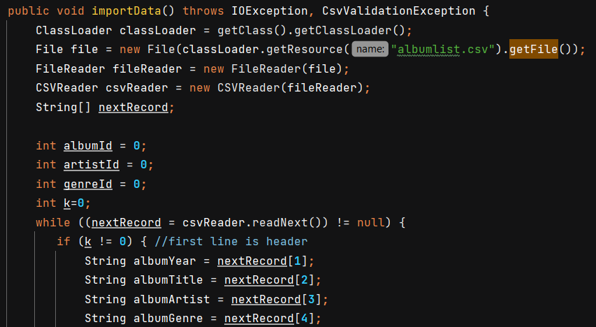

# Laborator 8

### Compulsory
- [x] Create a relational database using any RDBMS (Oracle, Postgres, MySql, Java DB, etc.).
- [x] Write an SQL script that will create the following tables:
   * albums: id, release year, title, artist, genre(s)
   * artists: id, name (for example: Beatles)
   * genres: id, name (for example: Rock)
   * an associative (junction) table in order to store each album genres
-[x] Update pom.xml, in order to add the database driver to the project libraries.
-[x] Create a singleton class in order to manage a connection to the database.
-[x] Create DAO classes that offer methods for managing artists, genres and albums (at least one).
-[x] Implement a simple test using your classes.

### Homework
- [x] Create an object-oriented model of the data managed by the Java application.
- [x] Implement all the DAO classes.
- [x] Use a connection pool in order to manage database connections, such as C3PO, HikariCP or Apache Commons DBCP.
    * Am folosit HikariCP
    * 
- [x] Create a tool to import data from a real dataset, such as Rolling Stone's 500 Greatest Albums of All Time (or other)]
    * Am folosit dataset-ul din laborator (albumlist.csv)
    * Functia importData() din clasa ImportTool citeste din fisier si insereaza in baza de date
    * 
    * 
# Laborator 9

### Compuslory
- [x] Create a persistence unit (use EclipseLink or Hibernate or other JPA implementation).
   * Verify the presence of the persistence.xml file in your project. Make sure that the driver for EclipseLink or Hibernate was added to your project classpath (or add it yourself).
- [x] Define the entity classes for your model (at least one) and put them in a dedicated package. You may use the IDE support in order to generate entity classes from database tables.
   * Clasele sunt in pachetul entities din pachetul jpa al proiectului
   * 
- [x] Create a singleton responsible with the management of an EntityManagerFactory object.
   * Clasa este PersistenceSetup din pachetul jpa al proiectului
   * 
- [x] Define repository classes for your entities (at least one). They must contain the following methods:
    * create - receives an entity and saves it into the database;
    * findById - returns an entity based on its primary key;
    * findByName - returns a list of entities that match a given name pattern. Use a named query in order to implement this method.
    * Clasele sunt in pachetul repos din pachetul jpa al proiectului
    * Am creat o clasa abstracta GenericRepository care contine metodele create, findById si findByName
    * 
- [x] Test your application.